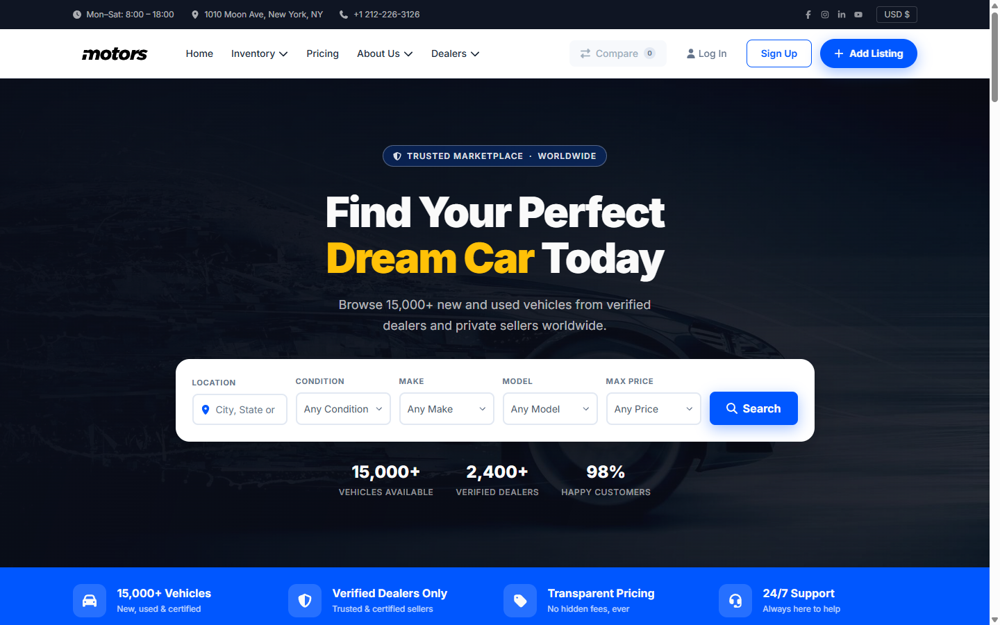

# Motors Theme Redesign

A redesign concept for an automotive classified marketplace homepage — cleaner layout, better conversion focus, and mobile-first approach.



## Live Preview

[https://gestilo.github.io/Motors_Theme_Redesign/](https://gestilo.github.io/Motors_Theme_Redesign/)

## About

This is a front-end prototype redesign of the [Motors WordPress theme](https://motors.stylemixthemes.com/elementor-classified-one/) homepage. The goal was to improve visual hierarchy, reduce clutter, and create a more user-friendly experience — particularly on mobile.

**Key improvements over the original:**
- Mobile-first layout (84%+ of used car searches happen on mobile)
- Cleaner hero with prominent search bar in the top 300px
- Trust signals section added
- Consistent design tokens (colors, spacing, typography)
- Lighter, more breathable card design

## Design System

A full design system is included at [/design-system.html](https://gestilo.github.io/Motors_Theme_Redesign/design-system.html) — covering colors, typography, spacing, border radius, shadows, buttons, and interactive element states.

## Tech Stack

- HTML5 (semantic)
- CSS3 (custom properties / design tokens, mobile-first)
- Vanilla JavaScript
- Font Awesome 7 (local SVG, no CDN dependency)
- Google Fonts — Inter

## Structure

```
index.html          — Homepage prototype
design-system.html  — Design system reference
assets/
  css/
    style.css       — Global styles & design tokens
    grid.css        — Layout system
    menu.css        — Navigation & header
  js/
    fa-local.js     — Local SVG icon injection
  images/           — All assets
```

---

© 2026 GEstilo. All rights reserved.
